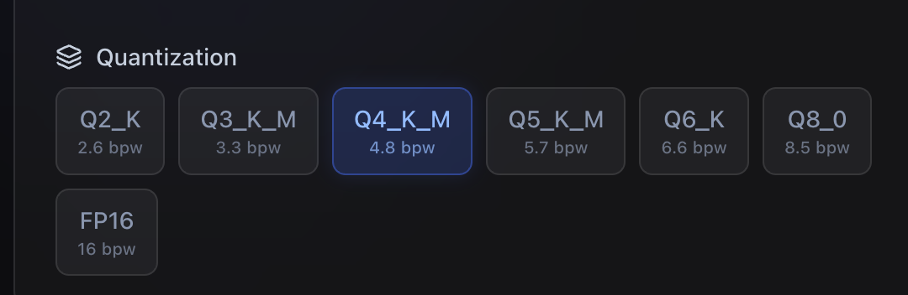

# LLM Speed Calculator

Estimate token generation speed for any GPU + LLM combination. Compare hardware, check VRAM requirements, and find the best setup for your needs.

**Live Demo:** [llmspeed.coinbx.com](https://llmspeed.coinbx.com/)



## Features

- GPU & Model selection with real benchmark data
- Quantization options (Q2_K to FP16)
- Multi-GPU configuration support
- Token generation speed estimation
- VRAM usage breakdown
- Streaming preview simulation
- Cost analysis (THB/USD)
- Cloud provider comparison
- Performance comparison chart

## Tech Stack

- Next.js 16
- React 19
- Tailwind CSS 4
- Recharts
- TypeScript

## Getting Started

```bash
npm install
npm run dev
```

Open [http://localhost:3000](http://localhost:3000)

## Production

```bash
npm run build
npm start -p 13013
```
